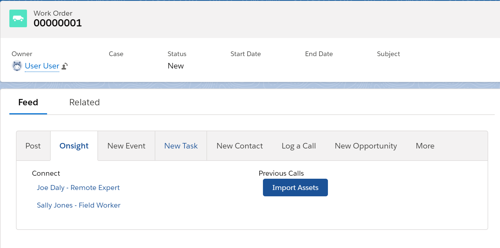
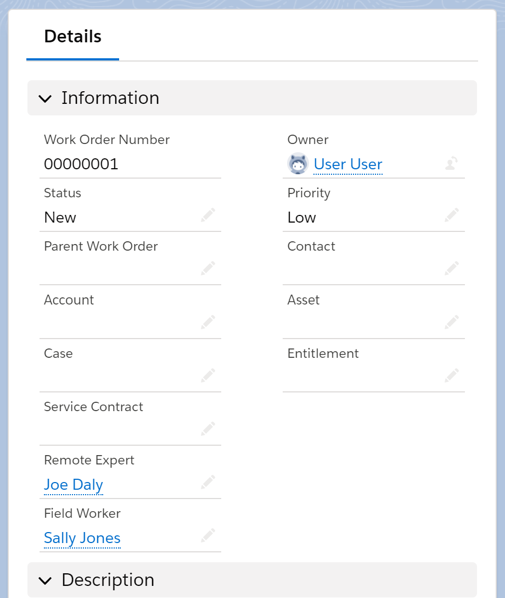

# Salesforce Integration for Onsight Connect and Onsight Workspace

## Deployment

### Pre-requisites

- A deployment environment; the integration uses the *sfdx* tool to deploy updates, so a Scratch org or similar environment is required.
- The Salesforce CLI tools (aka, *sfdx*). These can be installed by visiting https://developer.salesforce.com/docs/atlas.en-us.sfdx_setup.meta/sfdx_setup/sfdx_setup_install_cli.htm.

### Optional: Creating a temporary Scratch Org

For quick testing or development, you can create a temporary Scratch Organization to host a Salesforce deployment. The Scratch Org is a baseline deployment with no data and only factory-default metadata. It can have a lifetime up to 30 days, after which any changes made to the Scratch Org are wiped out, after which you will need to re-deploy a new Scratch Org.

The following command line steps outline how to create a new Scratch Org and to deploy the Onsight integration code to it. These steps use the *sfdx* command line tool and must be executed from the root of the Salesforce git repo directory:

```
# Create new scratch org (will last 30 days before being lost)
sfdx force:org:create -f config/project-scratch-def.json -a MyScratchOrg --setdefaultusername --durationdays 30

# Authenticate against the new org (will launch a browser window and prompt you to login/enter a password):
sfdx auth:web:login
```

### Push and Configure

Assuming you have an environment available (e.g., sandbox or scratch org), the integration can be deployed with the following command (from the project's root directory):
```
sfdx force:source:push
``` 

### Configure Named Credentials

Upon successful push deployment to your environment, you must configure the two following named credentials using the Salesforce Setup UI. The Named Credentials store your Onsight API Key for use with Onsight APIs used by the integeration.

The path to the Named Credentials page is *https://<your_env_url>/lightning/setup/NamedCredential/home*.

- Onsight Connect URI
- Onsight Workspace URI

For both of the above Named Credentials, set the following fields as follows:
- *Identity Type*: Named Principal
- *Authentication Protocol*: Password Authentication
- *Username*: any non-blank value (not used, but can't be blank)
- *Password*: Your Onsight API Key (required)

## Using the Integration

Once installed, Work Orders will have a new 'Onsight' tab under the 'Feed' view:



Be sure to assign the Remote Expert and/or Field Worker fields in the Work Order's 'Details' view:



### Launching Onsight Connect

Click one of the 'Connect' contact links in the 'Onsight' tab. This will launch the Onsight Connect application on your device, contacting the selected resource. The current Work Order ID will be associated with this Onsight Call, and the ID will also be applied to any assets recorded or captured during the call.

Upon concluding the Onsight Call, have Onsight upload any captured assets to Onsight Workspace.

Now, back in Salesforce, click the 'Import Assets' button. This will synchronize the current Work Order with your Onsight Workspace account, creating references within Salesforce to the corresponding Workspace documents/assets. Please note that the content of these Workspace documents is NOT copied into Salesforce; only references are made.

### Generate 2GP packages

Authorize your Dev Hub org.
sfdx auth:web:login

Make sure your project files for your package are in the force-app\main\default directory

Be sure to have a namespace defined in your sfdx-project.json file in the project root. 
To Link a Namespace to a Dev Hub Org follow the steps listed here:
https://developer.salesforce.com/docs/atlas.en-us.sfdx_dev.meta/sfdx_dev/sfdx_dev_reg_namespace.htm

From the project directory, create the package.
sfdx force:package:create --name "Test Project" --path force-app --packagetype Managed

Create a package version. This example assumes the package metadata is in the force-app directory.
sfdx force:package:version:create --package "Test Project" --installationkey test1234 --wait 10

**After creating the package you will see a new 'packageAliases' section in your projects 'sfdx-project.json' file, located in the project root.
We can only install the package versions into an org, the package versions identifier starts with '04t'.
Each verison will appear under the 'packageAliases' section with a new version number appeneded to the package name. 
You will use this package version name as a reference when installing your package to other orgs.

### Deploy 2GP package to an Org

Login to the Org where you plan to install the package.
sfdx force:auth:web:login -r https://<salesforce_url>

Install the package version into target Org using CLI.
sfdx force:package:install --package "Test Project@0.1.0-1" --targetusername test_user@test.salesforce.com --installationkey test1234 --wait 10 --publishwait 10

### Post Installation Steps

After the package is installed launch the Org and place the new components into the 'Work Order' layout.
As an Administrator, from Setup, click the Object Manager tab. Select 'Work Order', and open the Work Order Page Layouts setup page.
Select 'Fields' from the upper panel and drag the 'Field Worker' and 'Remote Expert' fields into the Information section of the layout.
Slect 'Mobile & Lighting Actions' from the upper panel and drag the 'Onsight' field into 'Salesforce Mobile and Lightning Experience Actions' panel.
Select 'Related Lists' from the upper panel and drag the 'Onsight connect Calls' field into the Related Lists section of the layout.

Enable the fields for non-admin profiles so users can view the contact links.
As an Administrator, from Setup, click Users and select Profiles. 
Select the Profile Name you would like to edit, under the Apps section select 'Object Settings' and select 'Work Orders' from the list of objects.
Select the edit button next to Work Order and give Read and Edit access to the following fields, then Save your changes:
Remote Expert
Field Worker

Enable the fields for non-admin profiles so users can view the Onsight Connect Calls. 
As an Administrator, from Setup, click Users and select Profiles. 
Select the Profile Name you would like to edit, under the Apps section select 'Object Settings' and select 'Onsight Connect Calls' from the list of objects.
Select the edit button next to Onsight Connect Calls and give Read access to "Work Order", then Save your change.

Enable the fields for non-admin profiles so users can view the Onsight Workspace Document. 
As an Administrator, from Setup, click Users and select Profiles. 
Select the Profile Name you would like to edit, under the Apps section select 'Object Settings' and select 'Onsight Workspace Documents' from the list of objects.
Select the edit button next to Onsight Workspace Documents and give Read access to the the following following fields, then Save your changes:
Download URL
External Metadata
Onsight Connect Call
Parent ID
Type

Non-admin profiles will also require access to the Apex Classes in the package. 
As an Administrator, from Setup, enter Apex Classes in the Quick Find box, then select Apex Classes.
Next to OnsightConnectController and OnsightWorkspaceController, click Security.
Select the profiles that you want to enable from the Available Profiles list and click Add then Save your changes.
